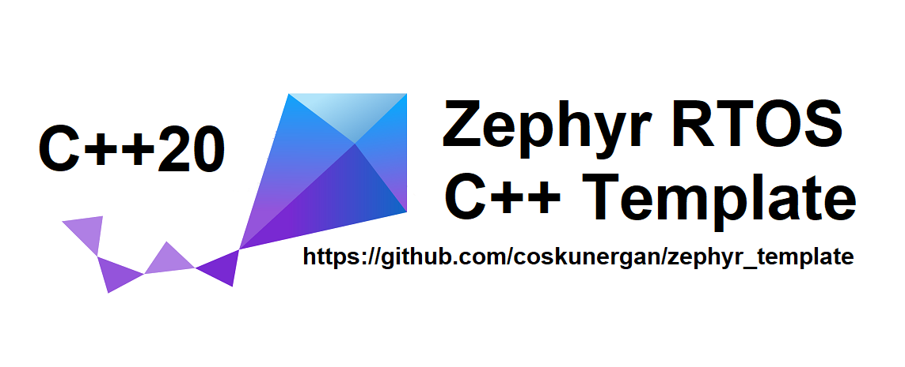

# Zephyr RTOS C++20 Template 

This code uses ZephyrRTOS and ZPP C++20 API. It is a template project where you can start from basic hardware and run advanced 3rd party applications. 

You must install the ZPP module under the zephyr header before compiling.

Zephyr RTOS installation and more see:
https://github.com/zephyrproject-rtos

ZPP Module installation:
https://github.com/lowlander/zpp

For a helpful setup and test utility see:
https://github.com/lowlander/zpp_bootstrap
